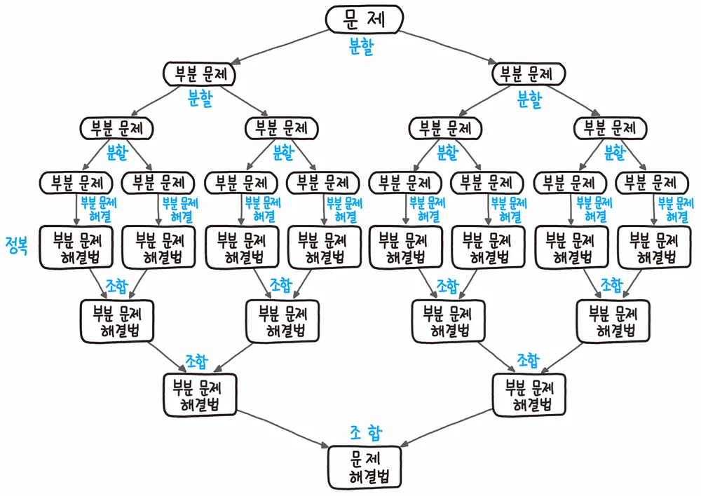
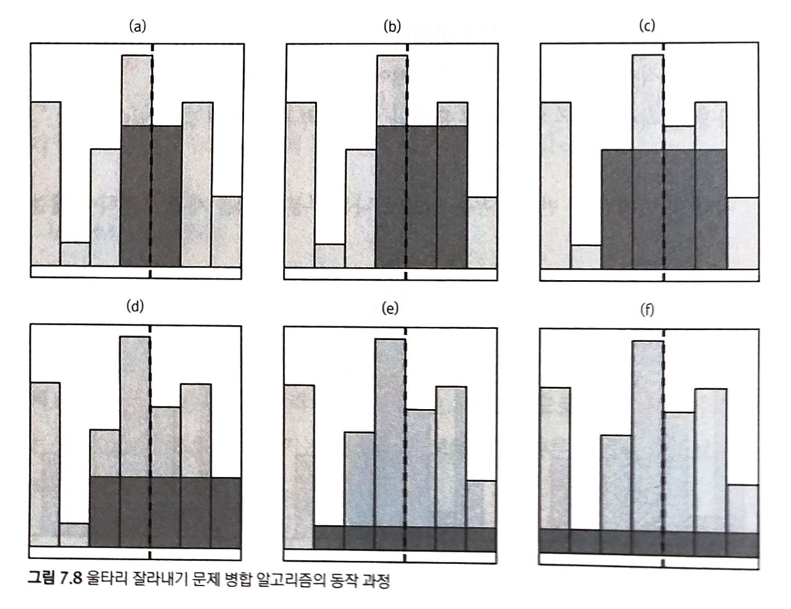
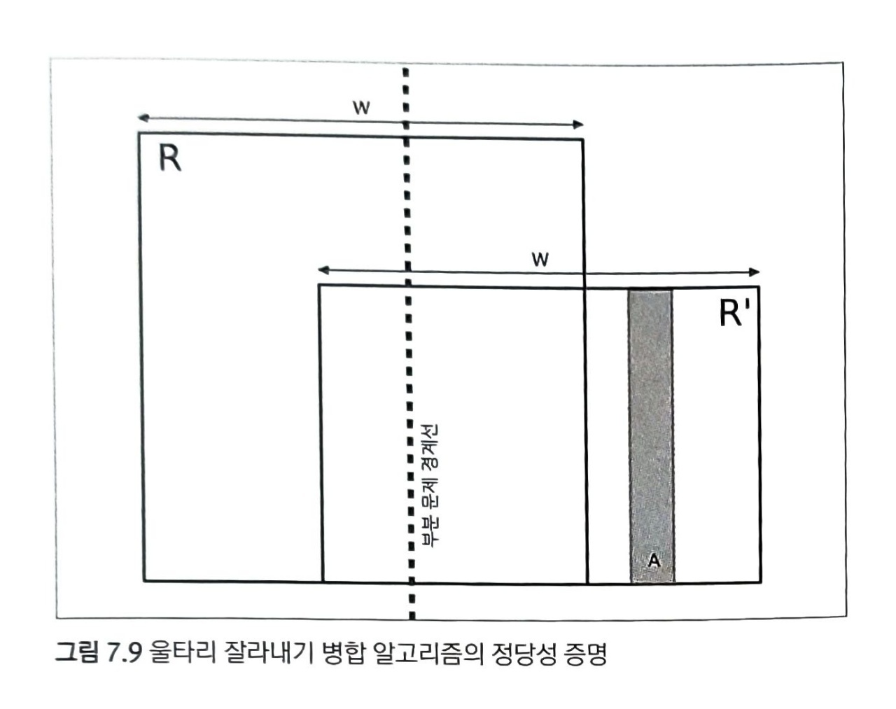

#  Ch. 7 - 분할정복 (Divide & Conquer)

<br>

## 개요

> 주어진 문제를 둘 이상의 부분 문제로 나눈 뒤 각 문제에 대한 답을 재귀 호출을 이용해 계산하고, 각 부분 문제의 답으로부터 전체 문제의 답을 계산해냅니다.



<br>

> 분할 정복이 일반적인 재귀 호출과 다른 점은 문제를 한 조각과 나머지 전체로 나누는 대신 거의 같은 크기의 부분 문제로 나누는 것입니다.


<br>

## 분할 정복 알고리즘의 구성 요소

1. 문제를 더 작은 문제로 분할하는 과정 - **Divide**
1. 각 문제에 대해 구한 답을 원래 문제에 대한 답으로 병합하는 과정 - **Merge (Combine)**
1. 더이상 답을 분할하지 않고 곧장 풀 수 있는 매우 작은 문제 - **Base Case (Conquer)**

<br>

## 예제

$1$부터 $n$까지 더하는 함수를 작성해봅시다.

일반적인 재귀함수는 아래와 같습니다.

```javascript
function sum(n) {
  if (n === 1)
    return 1
  return n + sum(n - 1)
}
```

반면, 분할 정복을 활용하면 아래와 같이 작성할 수 있습니다.

```javascript
function fast_sum(n) {
  if (n === 1)
    return 1
  if (n % 2 === 1)
    return fast_sum(n - 1) + n;
  return 2 * fast_sum(n / 2) + Math.pow(n, 2) / 4
}
```

왜 이렇게 작성되나 알아봅시다.

`fast_sum(n)`의 계산 값은 $1 + 2 + \cdots + n$ 입니다.

이를 반으로 쪼개 봅시다.

$(1 + 2 + \cdots + \frac{n}{2}) + ((\frac{n}{2} + 1) + \cdots + n)$ 이 됩니다.

첫 번째 부분은 `fast_sum(n / 2)`로 나타낼 수 있습니다.

그리고 머리를 잘 써보면 두 번째 부분을 아래처럼 바꿀 수 있습니다.

$(\frac{n}{2}+1)+(\frac{n}{2}+2)+\cdots+(\frac{n}{2}+\frac{n}{2})$

$=\frac{n}{2} \cdot \frac{n}{2} + (1 + 2 + 3 + \cdots + \frac{n}{2})$

$= (\frac{n}{2})^2 +$`fast_sum(n / 2)`

따라서 첫 번째 부분과 두 번째 부분을 합치면 다음과 같이 됩니다.

`fast_sum(n)` = $2 \times$`fast_sum(n / 2)`$+ \frac{n^2}{4}$

<br>

### 시간 복잡도 분석

`sum` 함수의 시간 복잡도는 예상할 수 있다시피 선형 시간입니다.

`fast_sum` 함수는 단계를 거듭할 수록 범위가 반 씩 줄어듭니다.

따라서, `fast_sum` 함수는 로그 시간의 시간 복잡도를 가집니다.

책에서는 `fast_sum`의 인수를 2진수로 나타내어 시간 복잡도를 계산합니다.

예를 들어, $11$의 경우 $1011_{(2)}$로 표현할 수 있고 ***이것의 길이 + 첫 1을 제외한 1의 개수***가 함수 총 호출 횟수입니다.

어떤 수 $n$을 2진수로 나타냈을 때의 길이는 $lg(n)$을 넘지 않습니다. (로그는 자릿수를 나타내기도 하니까!)

마찬가지로 2진수로 나타냈을 때 첫 $1$을 제외한 1의 개수도 $lg(n)$을 넘지 않습니다.

따라서 이 알고리즘의 실행시간은 $O(lg(n))$이 되는 것입니다.

<br>

## 핵심과 주의 사항

중요한 것은 문제를 잘게 쪼개며 작은 문제들을 **중복(Overlapping)** 시키는 것입니다.

행렬의 거듭제곱 문제를 분할 정복을 적용해 풀면 아래와 같이 풀 수 있습니다.

```javascript
// mat: n by n 행렬
// m: 지수
function pow(mat, m) {
  if (m === 0) 
    return identity
  if (m % 2 > 0)
    return pow(mat, m - 1) * mat
  const half = pow(mat, m / 2)
  return half * half
}
```

위에서 `m`이 홀수일 때, `pow(mat, Math.floor(m / 2)) * pow(mat, Math.floor(m / 2) + 1)`을 반환하면 더 낫지 않을까 싶을 수 있습니다.

하지만 이 경우 작은 문제들이 중복되지 않아 시간 복잡도가 증가하게 됩니다.


이후에 배울 동적 계획법에서 이러한 점을 주의깊게 다룹니다.

<br>

## 연습문제: 7.4 울타리 잘라내기 (난이도: 중)

_문제는 책 195페이지에 있습니다._

### 분할 정복 알고리즘의 설계

우리가 찾는 최대 직사각형은 다음의 세 경우 중 하나입니다.

1. 왼쪽 부분 문제에서만 잘라내는 경우
1. 오른쪽 부분 문제에서만 잘라내는 경우
1. 왼쪽과 오른쪽 부분 문제에 걸쳐있는 경우

1, 2번의 경우 각 경우를 따로 구한 뒤 최대값을 취하면 됩니다.

3번의 경우에는 1, 2번의 경계부터 시작하여 아래 순서대로 고려합니다.



<br>

### 코드

```cpp
// 각 판자의 높이를 저장하는 배열
vector<int> h;
// h[left, right] 구간에서 찾아낼 수 있는 가장 큰 사각형의 넓이를 반환한다.
int solve(int left, int right) {
    // 기저 사례: 판자가 하나밖에 없는 경우
    if(left == right) return h[left];
    // [left, mid], [mid+1, right]의 두 구간으로 문제를 분할한다.
    int mid = (left + right) / 2;
    // 분할한 문제를 각개격파
    int ret = max(solve(left, mid), solve(mid+1, right));
    // 부분 문제 3: 두 부분에 모두 걸치는 사각형 중 가장 큰 것을 찾는다.
    int lo = mid, hi = mid+1;
    int height = min(h[lo], h[hi]);
    // [mid, mid+1]만 포함하는 너비 2인 사각형을 고려한다.
    ret = max(ret, height*2);
    // 사각형이 입력 전체를 덮을 때까지 확장해 나간다.
    while(left < lo || hi < right) {
        // 항상 높이가 더 높은 쪽으로 확장한다.
        if(hi < right && (lo == left || h[lo-1] < h[hi+1])) {
            ++hi;
            height = min(hieght, h[hi]);
        }
        else {
            --lo;
            height = min(height, h[lo]);
        }
        // 확장한 후 사각형의 넓이
        ret = max(ret, height*(hi-lo+1));
    }
    return ret;
}
```

<br>

### 정당성 증명

1, 2번 경우에서 최대 사각형이 구해짐은 3번 경우에서 최대 사격형이 구해짐이 자명하면 참이 됩니다.

3번 경우에서 왜 항상 더 높은 판자를 선택하며 확장하는 것이 최대 사각형을 보장하는 것인지 알아봅시다.

귀류법을 이용합니다! 귀류법은 참을 가정하고 모순을 이끌어 내는 증명법입니다.

- 어떤 사각형 R이 있습니다. 이 사각형은 우리의 방법대로 찾은 최대 직사각형 보다 크다고 가정합니다.
- 우리가 고려한 사각형 중 R과 너비가 같은 사각형은 반드시 존재합니다. 그 사격형을 R'라고 합시다.
- 너비가 같으니 R이 더 넓으려면 R'보다 높이가 더 높아야겠죠.
- R과 R'은 가운데 경계를 포함하므로 항상 겹칩니다.



- R은 R'보다 넓으니까 R의 모든 판자는 A 판자보다 높아야 합니다.
- 우리가 A 판자를 선택하려면 경계 좌측으로 A 판자보다 낮은 판자가 있어야 합니다.
- 하지만 R'을 만드는 과정에서 경계 좌측에 있는 모든 판자는 R에 속하며 A 판자보다 높습니다.
- 따라서 모순이며 **그런 R은 존재하지 않습니다.**
- $\blacksquare$

<br>

### 시간 복잡도 분석

주어진 n 크기에서 재귀의 각 단계마다 탐색 범위가 반 씩 줄어듭니다. (로그 시간)

각 단계에서 탐색 범위 만큼 판자들을 하나하나 검사합니다. (선형 시간)

그러니 총 시간 복잡도는 O(nlgn) 입니다.