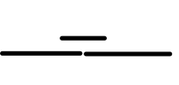
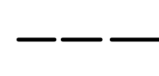
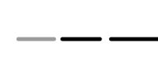
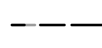

# 10.1. Greedy
탐욕법(greedy method)은 여러 조각으로 쪼개고, 각 단계마다 답의 한 부분을 만들어 나간다는 점에서 _완전탐색_ 혹은 *동적 계획법*과 다른게 없지만, 그러나 모든 선택지를 고려해 보고 그중 전체 답이 가장 좋은 것을 찾는 두방법과 달리, 탐욕법은 각 단계마다 지금 당장 가장 좋은 방법만을 선택합니다.
- 지금 당장 좋은걸 선택하는것만으로 답이 나온다고?
  - 물론 그렇진 않다고 합니다. 대부분의 케이스에 탐욕법은 최적해를 찾지 못합니다.
  - 그렇다보니 탐욕법이 사용되는 케이스는 크게 두가지로 나뉩니다.

### 탐욕법이 사용되는 케이스
1. 탐욕법을 사용해도 항상 최적해를 구할 수 있는 문제를 만나 경우. 이경우 dp보다 빠르기 때문에 유용하다.
2. 시간, 공간 제약으로 인해 최적해를 찾는게 너무어렵다면, 근사해를 구하는 방법으로써 사용.

주로 탐욕법은 1번 케이스에 사용됩니다. 2번 케이스는 거의 나오지 않고, 나오더라도 더 좋은 알고리즘이 존해하기때문이죠(조합탐색, 메타휴리스틱 알고리즘)

탐욕법의 개념은 간단하지만, 실제 문제를 만나면 그렇지 않다고 합니다.
- 탐욕법이 여러가지 방식이 존재할 수 있는데, 어떤게 최적해를 구하는 알아내기가 어렵다.
- 실제로 접근하는 방식이 직관적이지 않은 경우도 많다
  - 이를 위해 알고리즘의 정당성을 증명하는 과정을 연습하는게 좋다고합니다.
---
## 예제 1. 회의실 예약
탐욕법이 유용하게 사용되는 문제 중 유명한 예는 활동 선택 **문제(activity selection problem)** 이라고 합니다.

회의실 예약 문제)
하나의 회의실이 있을때, n( n<=100) 개의 팀이 각각 회의하고 싶은 시간이 주어 졌을때, 서로 겹치지 않는 회의들만 골라서 진행할떄, 최대 몇개나 선택이 가능할까?  
* 회의 input 값은 책 참고.


### 무식하게 풀 수 있을까?
모든 부분 집합을 하나하나 만들어 보며 그 중 회의들의 겹치지 않는 답들을 걸러내고 그중 가장 큰 부분 집합을 찾습니다. 그러나 n의 부분집합의 수는 2^n 이기때문에 n이 30만 되어도 너무 많은 시간이 걸리므로 시간안에 풀기는 힘듬.

### 구상
1. 길이가 가장 짧은 회의부터 하나하나 순회하면서 앞의 것들과 겹치지 않는 것들을 추가하는 방법
    - 그럴싸해 보이지만, 실상은 아닙니다.
    - 예를 들어 회의 시간이 `13~15` 가 있고, 또 `10~14`, `14~17` 이 있을땐
   
2. 가장 먼저 끝나는 회의부터 선택하기
   - 가장먼저 끝나는 회의 s를 선택
   - 끝나는 시간이 겹치는 회의를 모두 지우고
   - 다시 반복


### 정당성 증명: 탐욕적 선택 속성(Greedy choice property)
탐욕적 알고리즘의 정당성 증명은 대부분 일정한 패턴을 가진다고 합니다. 이 증명 패턴은 탐욕법을 통해 항상 최적해를 찾아낼 수 있다는 것을 두 가지의 속성을 증명함으로써 보입니다.

**1. 답의 모든 부분을 고려하지 않고 탐욕적으로 선택하더라고 최적해를 구할 수 있다. -> 이게 곧 탐욕적 선택 속성**

- 어떤 알고리즘에 이 속성이 성립한다면 우리가 각 단계에서 탐욕적으로 내리는 선택은 항상 최적해로 가는 길 중 하나라는 것입니다.
- 이 문제에서 이 속성은 다음과 같이 표현이 가능합니다

**가장 종료시간이 빠른 회의를 포함하는 최적해가 반드시 존재한다.**

1. 가장종료시간이 빠른 회의를 포함하지 않는 최적해가 있다고 해보자.
2. 만약 그중에서 제일 앞의 회의를 빼고, 가장종료시간이 빠른 회의를 대체해서 넣는다면,
3. 그 답 또한 최적해이므로 가장종료시간이 빠른 회의를 포함하는 최적해는 항상 존재한다.




### 최적 부분 구조
탐욕적 선택 속성을 만족해도, 만약 첫 번째 선택 후 남은 부분 문제는 최적이 아닌 다른 방법으로 풀어야한다면, 탐욕법으로 최적해를 구할 수 없을 것입니다. 따라서, 
탐욕법이 항상 최적의 답을 준다로 끝나지 않고, **항상 최적의 선택만을 내려서 전체 문제의 최적해를 얻을 수 있음** 을 보여야합니다.

### 구현

- 현재까지 구상한 알고리즘은 실제로 O(n^2)의 시간 복잡도를 가집니다. (리스트에 대한 전체 조회를 계속 해야하므로)
- 그래서 끝나는 시간에 대한 오름차순으로 정렬해두는 과정을 추가합니다. 
  - 이렇게 되면, 배열의 첫번째 회의는 무조건 선택하고,
  - 나머지 겹치는 경우는 무시하고 다음으로 겹치지않는 회의를 찾습니다. 
  - 이런식으로 N번의 조회만으로 문제가 풀리겠죠

최종적으로 알고리즘은 아래와같이 나옵니다.

```
  int n;
  int begin[100], end[100];
  int schedule() {
    // 일찍 끝나는 순서대로 정렬
    vector<pair<int,int>> order;
    for(int i = 0; i < n ; ++i) {
      order.push_back(make_pair(end[i], begin[i]));
    }
    sort(order.begin(), order.end());
    // earliest: 다음 회의가 시작할 수 있는 가장 빠른 시간
    // selected: 지금까지 선택한 회의 수
    int earliest = 0, selected = 0;
    for(int i = 0; i < order.size() ; ++i) {
      int meetingBegin = order[i].second, meetingEnd = order[i].first;
      if(earliest <= meetingBegin) {
        earliest = meetingEnd;
        ++selected;
      }
    }
    return selected;
  }
```
---
## 탐욕적 알고리즘 레시피
중간에 스킵한 **출전 순서 정하기** 마지막 부분을 보면 해당 부분이 나옵니다(p.375)

1. 문제의 답을 만드는 과정을 여러 조각으로 나눕니다
2. 각 조각마다 어떤 우선순위로 선택을 내려야 할지 결정합니다. 이에 대한 직관을 얻기 위해서 예제 입력이나 그외의 작은 입력을 몇 개 손으로 풀어보는것이 효율적입니다.
3. 어떤 방식이 동작할 것 같으면 두 가지 속성을 증명해 봅니다.
   1. 탐욕적 선택 속성: 항상 각 단계에서 우리가 선택한 답을 포함하는 최적해가 존재함을 보이면 됩니다.
      1. 이 증명은 대개 우리가 선택한 답과 다른 최적해가 존재함을 가정하고,
      2. 이것을 조작해서 우리가 선택한 답을 포함하는 최적해로 바꿀 수 있음을 보이는 형태로 이루어집니다.
   2. 최적 부분 구조: 각 단계에서 항상 최적의 선택만을 했을때 전체 최적해를 구할 수 있는지 여부를 증명합니다.
      1. 대부분 이속성이 성립하는지 아닌지는 자명하게 알 수 있습니다.
---
## 10.4 문제: 문자열 합치기
c언어의 strcat을 사용하면 두 문자열의 길이의 합 만큼의 연산이 수행된다고 합니다. (즉 비용이 두 문자열 길이의 합)
이 함수를 사용해서 n개의 문자열을 순서와 상관없이 합쳐서 한 개의 문자열로 만들고 싶습니다.
이때 최소 비용을 찾는 프로그램을 작성하세요.

- ex) input: {al, go, spot}
  - spotalgo, alspotgo, .. 상관없음
  - 예를 들어 (al + go)를 먼저 수행하고 이결과를 spot과 합치면,
    - (al + go): 4
    - (algo + spot) : 8
    - 12의 비용 발생
  - (al + spot)을 수행하고 그 결과를 go와 합치면,
    - (al + spot) : 6
    - (alspot + go) : 8
    - 14의 비용 발생
  
- 시간제한은 1초
- 64MB 이하 메모리 사용
- 1<= 문자열의 수 <= 100
- 문자열 길이는 1000이하
### 구상
문자 열을 병합할 때마다 병합되는 문자열들의 총 길이가 전체 비용에 더해집니다. 이때 합쳐진 결과 문자열의 길이를 원래 입력에 주어졌던 문자열별로 나눌 수 있습니다.
이렇게 각 비용을 분해해 보면 한 문자열로 인해발생하는 총비용은 이 문자열이 병합되는 횟수에 문자열의 길이를 곱한 것이라는 사실을 알 수 있습니다. (아래 예시에서 4의 경우는 총 3번 병합되므로 총합에 12만큼 비용발생) 

즉, 문자열 길이가 길수록 트리의 윗부분에 가깝고, 짧으면 짧을수록 아래쪽으로 내려가야한다는 직관을 얻을 수 있습니다.
```markdown
         12
       /    \
      4      8
     / \    / \
    3   1  1   7
              / \
             3   4
```

### 알고리즘 설계
위에서 생각한 직관에 따라 다음과 같은 아이디어를 가지고 설계를 시작합니다.

**항상 가장짧은 두 개의 문자열을 합치는 것이 어떨까**

이제 정당성 증명차례입니다. 위에서 살펴본것처럼 총 두가지 (탐욕적 선택 속성, 최적 부분 구조)를 만족하는지 살펴보고 만족한다면 이 알고리즘을 써서 구현하면됩니다.
우선 탐욕적 선택 속성부터 살펴 봅니다.
- **탐욕적 선택 속성**
  - 가장 짧은 두 문자열을 먼저 합치는케이스를 포합하는 최적해가 반드시 존재함을 증명해야함
    - 우선 두 가장짧은 문자열 a,b 가 있을때 이 문자열들을 처음으로 합치지 않는 최적해가 있다고 가정합니다.
```markdown
a)
           ...
          /
         X
       /    \
      ...   ...
     / \    / \
    ...    b   y
    / \         
  a    x
```
```markdown
b)
           ...
          /
         X'
       /    \
      ...    b
     / \    
    a   x
```

- X아래의 노드들의 위치를 아무리 바꾼들 X의 길이는 고정이므로 윗부분은 바뀌지 않습니다. (각각의 케이스에 대해서)
  - 따라서 X까지 문자열을 합치는데 필요한 비용만 신경씁니다.
- a)는 a,b가 각각 다른 문자열과 합쳐진 후, x에서 하나로 합쳐지는 경우입니다.
  - a,b는 가장 짧은 두 문자열이므로 x,y의 길이는 a,b와 같거나 클 수 밖에 없습니다. 이때 a,b가 X에서 각각 몇단계 떨어져있나 비교합니다.
    - 거리가 같은 경우: x와 b의 위치를 바꿔도 답은 변하지 않음.
    - 거리가 다를 경우: a,b 중 x에 더 가까운쪽이 더 먼쪽과 합쳐지도록 옮겨갑니다. a)처럼 a가 b보다 멀리있다면 b와 x의 위치를 바꿉니다.
      - 이 결과 x의 병합횟수는 줄고 b의 병합횟수는 그만큼 늘어나지만, x>=b 이므로 항상 이득이거나 같습니다.
- b)는 a가 다른 문자열과 합쳐지고, 이 문자열이 결과적으로 b와 합쳐지는 경우입니다. 
  - 이때 x를 b와 바꾸면 x가 병합되는 횟수는 줄고 b가 병합되는 횟수는 그만큼 늘어납니다. 
    - 위에서 살펴본것처럼 이케이스도 x>=b 이므로 항상이득이거나 같습니다.

즉, 우리와 다른(가장 작은 것들끼리 먼저 합치지않은) 최적해가 있더라도 위에서 살펴본것처럼 변형을해서 또다른 최적해를 찾아볼 수 있으므로 **탐욕적 선택 속성** 을 갖습니다.
- **최적 부분 구조**
  - 두 문자열을 합치고 나면남은 문자열들은 항상 최소 비용을 써서 합치는게 이득

두가지 조건을 만족하므로 이 알고리즘(탐욕법)은 항상 최적의 방법을 찾아냅니다.

### 구현
- 문자열의 길이의 목록을 유지하면서 최소 길이를 골라내고, 새 길이를 추가하는 과정을 반복합니다.
- 이런 동작에 대한 구조로 우선순위 큐를 사용합니다.
  - 집합에서 가장 작은 원소를 찾거나, 새 원소를 추가하는 작업 모두 `O(lg n)`시간안에 수행

```
//문자열들의 길이가 주어질 때, 하나로 합치는 최소 비용을 반환한다.
int concat(const vector<int>& lengths) {
  // 최소 큐 선언
  priority_queue<int, vector<int>, greater<int>> pq;
  for(int i = 0; i < lengths.size(); ++i) {
    pq.push(lengths[i]);
  }
  int ret = 0;
  //원소가 하나 이상 남은 동안 반복
  while(pq.size() > 1) {
  //가장 짧은 문자열 두 개를 찾아서 합치고 큐에 넣는다.
  int min1 = pq.top(); pq.pop();
  int min2 = pq.top(); pq.pop();
  pq.push(min1 + min2);
  ret += min1 + min2;
  }
  return ret;
}
```
- 시간 복잡도 분석
  - concat()함수내의 `while문`은 `n-1`번 수행되고, 그 안에서 수행하는 `pq.top()`, `pq.push()`는 `O(lg n)`의 시간이 걸리므로 총 수행시간은 `O(n*lg(n))`이다.

- 추가로 이 문제는 허프만 코드라는 유명한 탐욕법 알고리즘의 각색버전이라고 합니다.

---

유태정: https://www.acmicpc.net/problem/1636
매우 어려움
매우 어려움
5

김하진:https://leetcode.com/problems/strong-password-checker/
그리디 떠올리기 어렵고, 조건이 많은 편
전형적인 hard
6

박진영:https://leetcode.com/problems/container-with-most-water/
그리디 떠올리기 어려움 근데 답을 보면 그리디
어려움
8

서민혁: https://www.acmicpc.net/problem/1036
그리디는 명확한데 36진수가 귀찮음
평범
3 (그리디 비중이 낮음)

이재혁: https://www.acmicpc.net/problem/6068
정렬
정렬
6

이성구: https://www.acmicpc.net/problem/2879
그리디 강추
체감 실버1~골드4
10

김재헌: https://www.acmicpc.net/problem/19700
교육적 very good
골드1 적당
9

한태혁: https://leetcode.com/problems/earliest-possible-day-of-full-bloom/
그리디로 적절, 그림있어서 좋앗다
hard치곤 쉬웠다
9

박상준: https://leetcode.com/problems/partition-labels/
무난. 개성이 있지는 않다
어렵지는 않다.
6