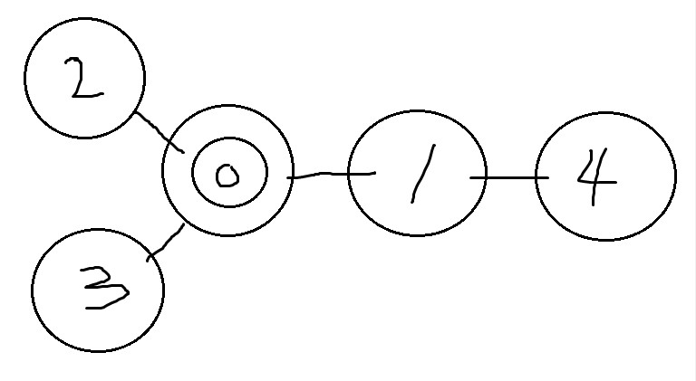

# dp (dynamic programming)

## 1. 🤔 dp vs 분할 정복

큰 의미에서 dp는 day03의 `분할정복`과 접근 방식이 같습니다.

-> 부분 문제로 큰 문제를 계산하기 때문에!

 <br>
 <br>

차이점 : 문제를 나누는 방식

동적 계획법의 어떤 부분 문제는 두 개 이상의 문제를 푸는데 사용될 수 있다.

따라서 부분 문제를 `캐시`에 저장해두고 재활용함으로써 속도향상의 이점을 얻을 수 있다.

```
             abcdefg
             /     \
         abcde     cdefg
         /    \   /    \
       abc     cde     defg
       /  \   /   \   / ㅣ \
     ab     c      de   f   g
    / ㅣ          /  \
   a   b         d    e
```

cde : abcde, cdefg에서 각각 한 번씩 계산

c, de : 각각 세 번씩 계산

=> 분할의 깊이가 깊어질 수록 지수적으로 증가

**하위 문제에 중복이 있다 -> dp를 사용**

<br>
<br>

## ex

```
n       n-1     n-1
    =        +
r       r-1      r
```

```c
int bino (int n, int r) {
  if (r==0 || n==r) return 1;

  return bino (n-1,r-1) + bino (n-1,r);
}
```

<br>
<br>


`bino(25,12)`를 계산하기 위해 약 천만 번의 함수호출이 필요하다고 합니다 오싯
<br>
<br>

-> memoization을 해라

```c

// 값은 -1로 초기화해 둠
int cache[30][30];

int bino2 (int n, int r) {
  if (r==0 || n==r) return 1;

  if (cache[n][r]!=-1) return cache[n][r];

  return cache[n][r] = bino2(n-1,r-1) + bino2(n-1,r);
}
```

### 그럼 언제 memoization을 적용할 수 있을까?

=> 참조 투명성이 보장되는 경우 (same input -> same output)

입력값에 따라 다른 값이 반환되면 캐싱이 불가하기 때문

<br>
++ 이 책에서는 항상 같은 형태로 메모이제이션 구현

-> memset()으로 캐시 값을 -1로 초기화하고 cache[a][b]의 주솟 값을 ret 변수에 저장한 형태

<br>

## 메모이제이션의 시간 복잡도 분석

(존재하는 부분 문제의 수) X (한 부분 문제를 풀 때 필요한 반복문의 수행횟수)

bino2의 시간 복잡도

O(n^2) X O(1) = O(n^2)

-> 부분문제의 최대 수=n^2, 반복문 X

함수가 n\*r번 호출 되는데 r의 최댓값이 n이므로 존재하는 부분 문제의 수는 O(n^2)

<br>

※ 정수의 역원을 이용해서 O(n)으로도 가능

https://koosaga.com/63 구사과님

<br>
예제를 봅시다

215p 외발 뛰기 (하)

```c++
// 단순 재귀로 구현
int n, board[100][100];

bool jump(int y, int x) {

  if (y>=n || x>=n) return false;

  if (y==n-1 && x==n-1) return true;

  int jumpSize = board[y][x];

  return jump(y+jumpSize,x) || jump(y,x+jumpSize);
}

```

여기서 jump()는,

1 . 참조투명성이 보장됩니다.

2 .입력의 10000개 인데, 완전 탐색시 만들어지는 경로의 수는 매우 많습니다.

3 . 비둘기집 원리에 의해 중복으로 해결되는 부분 문제들이 항상 존재합니다.

```c++
// 중복연산을 없앰
// 캐시 값을 사용하기 위해 bool -> int로 변환한 것 말고는 동일

int n, board[100][100];
int cache[100][100];

int jump2(int y, int x) {

  if (y>=n || x>=n) return 0;
  if (y==n-1 && x==n-1) return 1;

  int& ret = cache[y][x];
  if(ret!=-1) return ret;

  int jumpSize=board[y][x];
  return ret = (jump2(y+jumpSize,x) || jump2(y,x+jumpSize));
}
```

동적 계획법의 구현 단계

1. 주어진 문제를 완전 탐색을 이용해 해결
2. 중복된 부분 문제를 한 번만 계산하도록 메모이제이션을 적용

재귀말고 반복문으로 dp구현 -> 9장에서...

<br>

## 최적화

dp는 최적화 문제의 해답을 빠르게 찾기 위해 고안되었고, 가장 일반적인 문제의 사용처 또한 최적화 문제입니다.

여기서도 역시 완전탐색에서 시작하지만, 메모이제이션을 적용해 좀 더 효율적으로 동적 게획법을 구현할 수 있습니다.

<br/>

대략적인 설계 과정입니다.

1. 모든 답을 만들어 보고 그 중 최적해를 반환하는 완전 탐색 알고리즘을 설계합니다.
2. 전체 답이 아닌 앞으로 남은 선택에 대한 값만을 반환하도록 부분문제 정의를 바꿉니다.
3. 재귀 호출의 입력에 이전의 선택에 관련된 정보가 있다면 꼭 필요한 것만 남기고 줄입니다. (최적 부분 구조가 성립할 경우 이전 선택 관련 정보를 완전히 없애도 됨 )
4. 입력이 배열이거나 문자열이면 적절한 변환을 합니다.
5. 메모이제이션을 적용합니다.

또 다른 예제입니다.

<br>

270p 두니발 박사의 모험 (중)

https://www.algospot.com/judge/problem/read/NUMB3RS

```
2
5 2 0
0 1 1 1 0
1 0 0 0 1
1 0 0 0 0
1 0 0 0 0
0 1 0 0 0
3
0 2 4
```

<br/>
<br/>
<br/>

<br/>
<br/>
<br/>
<br/>

```c
// n=마을 수 d=지난 날 p=교도소가 있는 마을 q=d일 후 마을
int n,d,p,q;

// connected=map deg[i]=마을i와 연결된 마을의 갯수
int connected[51][51], deg[51];

double search(vector<int>& path) {

// base case : d일이 지난 경우
if (path.size()==d+1) {
// q에서 안 끝나면 무효
if(path.back()!=q) return 0.0;

    double ret = 1.0;

    for(int i=0; i+1<path.size(); ++i)
      ret /= deg[path[i]];
    return ret;

}

double ret=0;

for(int there=0; there<n; ++there) {
if(connected[path.back()][there]) {
// 가능한 마을 다 넣어보고 확률 더해줌
path.push_back(there);
ret += search(path);
path.pop_back();
}
}
return ret;
}

```

위의 설계 과정을 적용

1. path -> 지난 날짜(days), 그 때 숨어있는 마을(here)만 파라미터로 전달

2. 전체 경로의 확률 계산 -> 현재 위치에서 시작해 남은 날짜 동안 움직여 q에 도달할 확률을 계산

`search3(here,days)` : 두니발이 days일 째에 here번 마을에 있을 확률 반환

```c
int n,d,p,q;
double cache[51][101];

int connected[51][51], deg[51];

double search3(int here, int days) {

  // base case : 0일 째
  if (days==0) return (here==p ? 1.0 :0.0);

  double& ret=cache[here][days];

  if(ret > -0.5) return ret;
  ret=0.0;

  for(int there=0; there<n; ++there) {
    if(connected[here][there])
      ret += search3(there,days-1) / deg[there];
  }

  return ret; 
}
```

시간복잡도 -> O(n^2\*d)

search2 -> O(n^2\*d\*t) -> q가 바뀌면 모든 문제의 답이 바뀜 -> test case 갯수만큼의 시간복잡도

search3 -> O(n^2\*d) -> 경로의 반대쪽 끝q 부터 경로를 만듦

<br>
<hr/>

유태정: https://leetcode.com/problems/maximum-subarray/

김하진:https://leetcode.com/problems/edit-distance/

박진영:https://leetcode.com/problems/unique-binary-search-trees/
                                                                  
서민혁: https://www.acmicpc.net/problem/24888

이재혁: https://www.acmicpc.net/problem/1106

이성구: https://www.acmicpc.net/problem/2293

김재헌: https://www.acmicpc.net/problem/1231

한태혁: https://leetcode.com/problems/predict-the-winner/

박상준: https://leetcode.com/problems/best-time-to-buy-and-sell-stock/
