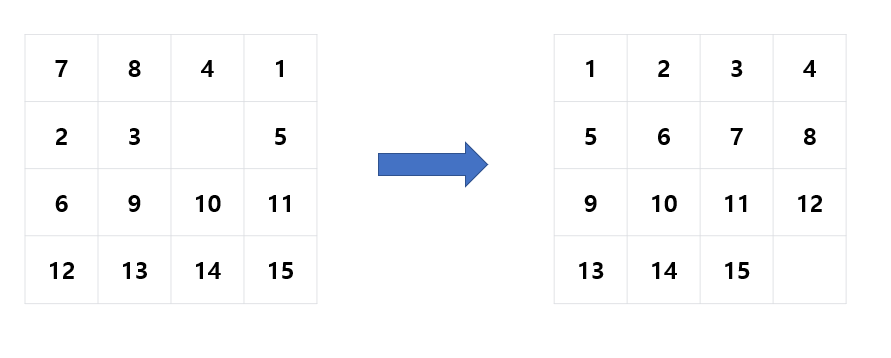
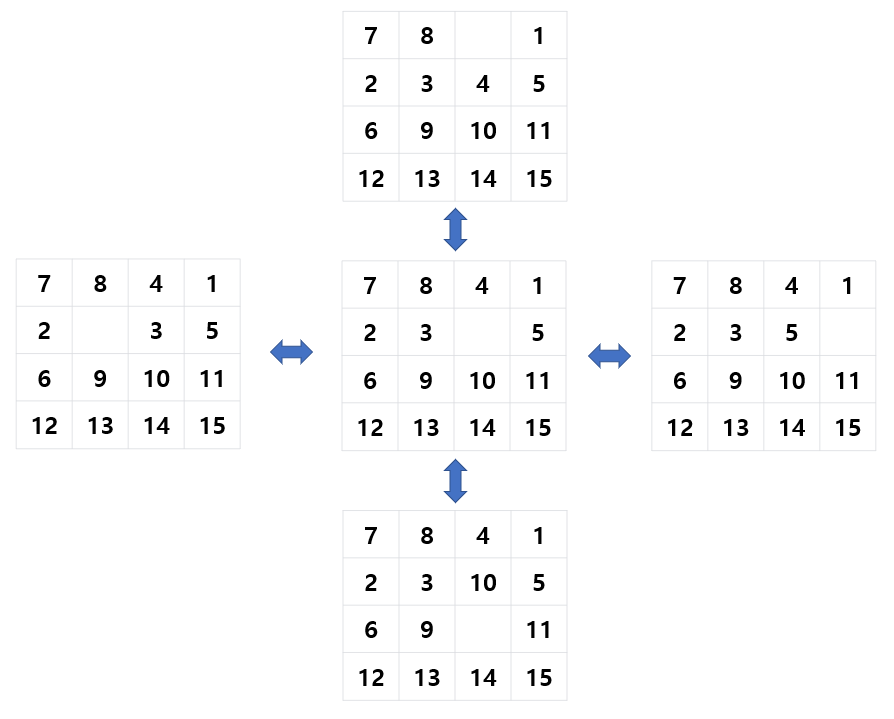
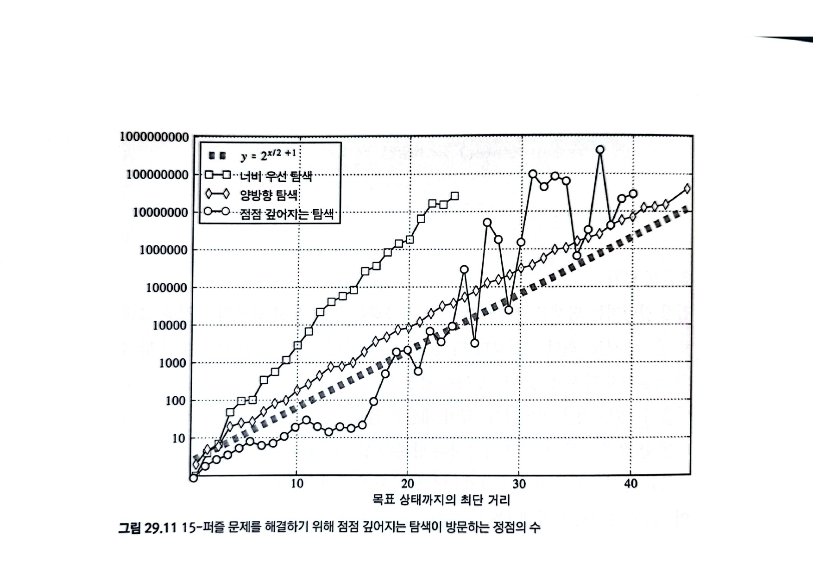

# BFS (너비 우선 탐색, Breadth First Search)

### **시작점에서 가까운 정점부터 순서대로 방문하는 탐색 알고리즘**

<br><br>

### 시작점 a부터 간선 i개를 지나야 도착할 수 있는 정점의 집합을 H<sub>i</sub>라고 하면


- H<sub>0</sub> : a
- H<sub>1</sub> : h, e, d, b
- H<sub>2</sub> : f, c, g
- H<sub>3</sub> : i

=> 시작점과 각 정점 사이에 경로가 두 개 이상인 경우, 최단 경로가 방문 순서를 결정

<br>

## BFS의 동작 순서

1. 각 정점을 방문할 때마다 모든 인접 정점들을 검사
2. 이 중 처음 보는 정점을 발견하면 이 정점을 방문 예정이라고 기록 (별도로 저장)
3. 인접한 정점을 모두 검사하고 나면, 지금까지 저장한 목록에서 다음 정점을 꺼내서 방문

<br>

### 시작점 a 그림에 적용하기

    1. 시작점 a를 방문
    2. 처음 보는 정점 b, d, e, h를 목록에 추가
    3. b를 꺼내 방문했다고 하면 (어느 정점을 먼저 꺼내도 상관 X)
    4. 처음 보는 정점 c를 목록에 추가 (* c는 먼저 추가된 d, e, h가 방문되기 전까지 방문 불가 *)
        => 구현 방법: 목록에 먼저 넣은 정점을 항상 먼저 꺼내면 된다. (= FIFO, 큐)
    5. ... 이런 식으로 계속 이어나가면 된다.


### BFS의 코드

```c++
// 그래프의 인접 리스트 표현
vector<vector<int>> adj;
// start에서 시작해 그래프를 너비 우선 탐색하고 각 정점의 방문 순서를 반환
vector<int> bfs(int start){
    // 각 정점의 방문 여부
    vector<bool> discovered(adj.size(), false);
    // 방문할 정점 목록을 유지하는 큐
    queue<int> q;
    // 정점의 방문 순서
    vector<int> order;
    discovered[start] = true;
    q.push(start);
    while(!q.empty()){
        int here = q.front();
        q.pop();
        // here을 방문한다
        order.push_back(here);
        // 모든 인접한 정점을 검사한다
        for(int i = 0; i < adj[here].size(); ++i){
            int there = adj[here][i];
            // 처음 보는 정점이면 방문 목록에 집어넣는다
            if(!discovered[there]){
                q.push(there);
                discovered[there] = true;
            }
        }
    }
       return order;
}
```

    # 정점의 상태 #
    1. 아직 발견되지 않은 상태
    2. 발견되었지만 아직 방문되지는 않은 상태
    3. 방문된 상태

- visited[]가 아니라 discovered[]를 사용 => 발견을 한 것이고, 방문을 한 것은 아니다.

  참고 (DFS)

  ```C++
  // 그래프의 인접 리스트 표현
  vector<vector<int> > adj;
  // 각 정점을 방문했는지 여부를 나타낸다.
  vector<bool> visited;
  // 깊이 우선 탐색을 구현한다.
  void dfs(int here){
      cout << "DFS visits " << here << endl;
      visited[here] = true;
      // 모든 인접 정점을 순회하면서
      for(int i = 0; i < adj[here].size(); ++i){
          int there = adj[here][i];
          // 아직 방문한 적 없다면 방문한다.
          if(!visited[there])
              dfs(there);
      }
      // 더이상 방문할 정점이 없으니, 재귀 호출을 종료하고 이전 정점으로 돌아간다.
  }

  // 모든 정점을 방문한다.
  void dfsAll(){
      // visited를 모두 false로 초기화한다.
      visited = vector<bool>(adj.size(), false);
      // 모든 정점을 순회하면서, 아직 방문한 적 없으면 방문한다.
      for(int i = 0; i < adj.size(); ++i)
          if(!visited[i])
              dfs(i);
  }
  ```

<br>

## 너비 우선 탐색 스패닝 트리 (BFS Spanning Tree)

- 너비 우선 탐색에서 새 정점을 발견하는 데 사용했던 간선들만 모든 트리
- ChatGPT 피셜:
  ```
  가장 가까운 친구 찾기: 소셜 미디어 플랫폼에서 특정 사용자의 친구를 찾는 경우, BFS 스패닝 트리 알고리즘을 사용하여 해당 사용자와의 가장 가까운 친구를 찾을 수 있습니다.

      네트워크 탐색: 컴퓨터 네트워크에서 호스트 간의 연결을 찾는 경우, BFS 스패닝 트리 알고리즘을 사용하여 호스트 간의 최단 경로를 찾을 수 있습니다.

      데이터 마이닝: 대용량 데이터에서 관심 있는 데이터를 추출하는 경우, BFS 스패닝 트리 알고리즘을 사용하여 특정 데이터와 연결된 다른 데이터를 찾을 수 있습니다.
      ```

  

<br>

## 너비 우선 탐색의 시간 복잡도

= 깊이 우선 탐색의 시간 복잡도

모든 정점을 한 번씩 방문하며, 정점을 방문할 때마다 인접한 모든 간선을 검하기 때문에

- 인접 리스트인 경우 **O(|V| + |E|)**
- 인접 행렬인 경우 **O(|V|<sup>2</sup>)**


<br>

<br>

# 최단 경로 전략

## 너비 우선 탐색과 최단 거리

너비 우선 탐색은 대게 하나의 용도로 사용되는데, 그게 (가중치가 없는 그래프의) 최단 경로 문제를 푸는 것이다

<br>

## 예제: 15-퍼즐

4x4 타일에 대하여 처음 주어진 상태를 그림의 오른쪽처럼 종료 상태로 바꿀 때,
필요한 최소 움직임의 수를 계산해보자



<br>

### 1. 게임판의 상태를 정점으로 표현한 그래프로 만들기



- 한 번의 움직임으로 한 상태를 다른 상태로 바꿀 수 있을 때 두 정점을 간선으로 연결

### 2. 너비 우선 탐색(BFS)으로 구해보자

```c++
// 게임판의 상태를 표현한다.
class State
{
    // 인접한 상태들의 목록을 반환한다
    vector<State> getAdjacent() const;
    // map에 State를 넣기 위한 비교 연산자
    bool operator < (const State& rhs) const;
    // 종료 상태와 비교하기 위한 연산자
    bool operator == (const State& rhs) const;
};
typedef map<State, int> StateMap;

// start에서 finish까지 가는 최단 경로의 길이를 반환한다
int bfs(State start, State finish)
{
    // start == finish인 경우
    if(start == finish) return 0;
    // 각 정점까지의 최단 경로의 길이를 저장한다
    StateMap c;
    // 앞으로 방문할 정점들을 저장한다
    queue<State> q;
    q.push(start);
    c[start] = 0;
    // BFS
    while(!q.empty())
    {
        State here = q.front();
        q.pop();
        int cost = c[here];
        // 인접한 정점들의 번호를 얻어낸다
        vector<State> adjacent = here.getAdjacent();
        for(int i = 0; i < adjacent.size(); ++i)
        {
            if(c.count(adjacent[i]) == 0)
            {
                if(adjacent[i] == finish) return cost + 1;
                c[adjacent[i]] = cost + 1;
                q.push(adjacent[i]);
            }
        }
    }
    return -1;
}
```

- BFS 쓰니까 좋기는 한데... 대충 4개까지는 아니고 2.x개의 간선이 존재한다고 쳐도 O(b<sup>d</sup>)
- b = 2.x, d = 목표 정점까지 최단 거리
- d가 24면 2600만개의 정점을 방문해야 함

<br>

### 3. 양방향 탐색으로 구해보자

- 양방향 탐색: 시작 정점에서 정방향 탐색 + 목표 정점에서 역방향 탐색 => 이 둘이 가운데서 만나면 종료

```c++
// 15-퍼즐 문제의 상태를 표현하는 클래스
class State;
// x의 부호를 반환한다
int sgn(int x)
{
    if(!x)
        return 0;
    return x>0 ? 1: -1;
}
// x의 절대값을 1 증가시킨다
int incr(int x)
{
    if(x<0)
        return x-1;
    return x+1;
}
// start에서 finish까지 가는 최단 경로의 길이를 반환한다
int bidirectional(State start, State finish)
{
    // 각 정점까지의 최단 경로의 길이를 저장한다
    map<State, int> c;
    // 앞으로 방문할 정점들을 저장한다
    queue<State> q;
    // start == finish인 경우
    if(start == finish) return 0;

    // 정방향, 역방향 구분을 위해 1, -1 사용
    q.push(start); c[start] = 1;
    q.push(finish); c[finish] = -1;

    // BFS
    while(!q.empty())
    {
        State here = q.front();
        q.pop();

        // 인접한 상태들을 검사한다.
        vector<State> adjacent = here.getAdjacent();
        for(int i = 0; i < adjacent.size(); i++)
        {
            map<State, int>::iterator it = c.find(adjacent[i]);
            // c.find(adjacent[i]) 결과가 없을 때 = 처음 발견한 정점일 때
            if(it == c.end())
            {
                c[adjacent[i]] = incr(c[here]);
                q.push(adjacent[i]);
            }
            // 처음 발견한 게 아닌데, 부호까지 다르다 => 서로 만났다
            else if(sgn(it->second) != sgn(c[here]))
                return abs(it->second) + abs(c[here]) -1;
        }
    }
    return -1;
}
```

- 일반적인 BFS보다 좋기는 한데... 양방향 그래프가 아니라면? 애초에 최단 거리가 어마어마하게 크다면?

<br>

### 4. 점점 깊어지는 탐색 (Iteratively Deepening Search, IDS)

- 임의의 깊이 제한 l을 정한 후 이 제한보다 짧은 경로가 존재하는지 DFS로 확인
- 답을 찾으면 반환, 답을 못 찾으면 l을 늘려서 다시 시도

```c++
// 상태를 표현하는 클래스
class State;
// 지금까지 찾아낸 최단 경로의 길이
int best;

// DFS
void dfs(State here, const State& finish, int steps)
{
    // 지금까지 구한 최적해보다 더 좋을 가능성 X
    if(steps >= best) return;
    // 목표 상태에 도달한 경우
    if(here == finish) {best = steps; return;}
    // 인접 상태들을 깊이 우선 탐색으로
    vector<State> adjacent = here.getAdjacent();
    for(int i = 0; i < adjacent.size(); i++)
       dfs(adjacent[i], finish, steps + 1);
}

// IDS
int ids(State start, State finish, int growthStep)
{
    for(int limit = 4;;limit += growthStep)
    {
        best = limit + 1;
        dfs(start, finish, 0);
        if(best <= limit) return best;
    }
    return -1;
}
```

- DFS니까 메모리 사용 적음
- 대신 깊이 제한을 늘려가면서 DFS를 반복하니까 정점을 반복적으로 방문하는 낭비 발생
- 목표 정점까지의 최단 거리가 d이고, 분기수가 b, 깊이 제한이 1부터 1씩 증가하면
  (d+1)*b<sup>0</sup> + d*b<sup>1</sup> + (d-1)b<sup>2</sup> + ... + 2*b<sup>(d-1)</sup> + 1*b<sup>d</sup>
- 이것도 결국에는 O(b<sup>d</sup>)지만, 메모리 사용이 적고 여러 가지치기 기법을 적용하기 쉬워서 더 빠른 경우도 있다.

<br>

## 성능 비교



## 탐색 방법 선택하기

탐색 방법의 장단점을 고려하여 선택해야한다.

1. 상태 공간에서의 최단 경로를 찾는 경우, bfs 최우선 고려

   직관적이고 구현도 간단, 탐색의 깊이 한계가 정해져있지 않거나 너무 깊어서 메모리 사용량이 너무 큰지 확인

2. 상태 공간에서의 최단 경로를 찾는데, 탐색의 최대 길이가 정해짐, bfs하기에 메모리, 시간이 부족 = 양방향 탐색

   단, 목표상태에서 역방향으로 움직이기 쉬워야함

3. 위 두 탐색이 모두 메모리를 많이 사용하거나 너무 느린 경우,

   최적화를 할 거리가 더 많을 경우, 점점 깊어지는 탐색사용

<br><br>

# 문제 풀이

유태정:

김하진:

박진영:https://leetcode.com/problems/the-maze/

서민혁:

이재혁:

이성구: https://www.acmicpc.net/problemset?sort=ac_desc&algo=7

김재헌:

한태혁:

박상준: https://leetcode.com/problems/longest-increasing-path-in-a-matrix/

조민준:
