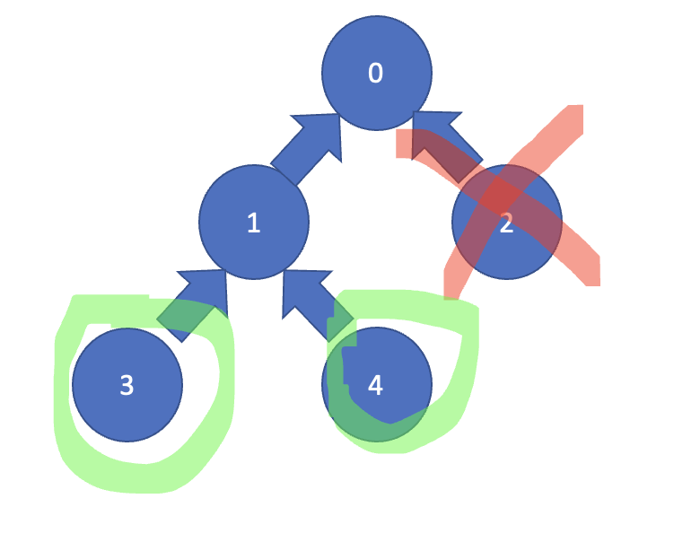
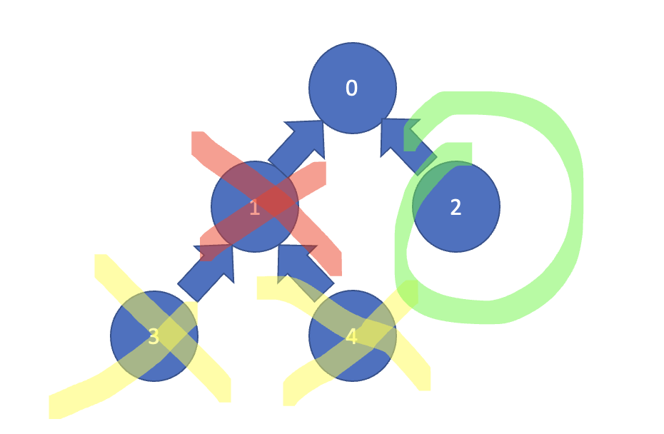
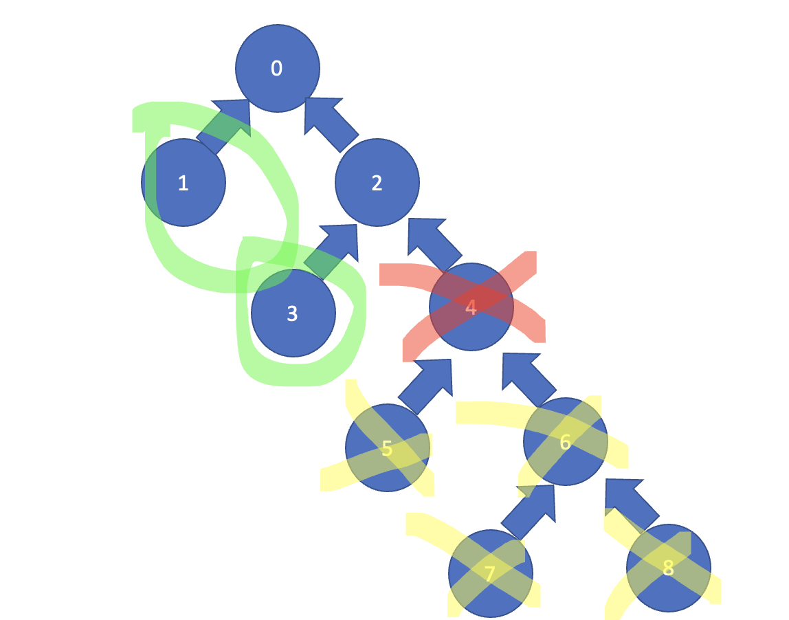
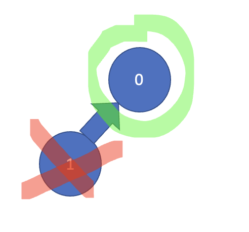

문제설명

입력:

첫줄에 n (노드의 개수)

두번째 줄에 n개의 숫자들 (i번째 숫자는 i번 노드의 부모노드를 의미한다. -1은 루트노드를 의미한다.)

세번째 줄에 k (삭제할 노드의 번호)

----------------------
출력: 리프노드의 수

----------------------
0 <= k < n<= 50

```
입력:  
5
-1 0 0 1 1
2
```
```
출력
2
```



```
입력
5
-1 0 0 1 1
1
```
```
출력
1
```


```
입력
5
-1 0 0 1 1
0
```
```
출력
0
```



```
입력
9
-1 0 0 2 2 4 4 6 6
4
```
```
출력
2
```


문제는 이제 다 이해했을것이라고 생각합니다.


예외 케이스 : 노드가 삭제됨으로써 새로운 리프노드가 생기는 경우.
```
입력
2
-1 0
1
```
```
출력
1
```



```C++
#include<bits/stdc++.h>


using namespace std;
#define endl '\n'
#define fast_io ios_base::sync_with_stdio(0); cin.tie(0); cout.tie(0);

int n, k;
//tree는 
vector<int> tree[50], childNum, arr;


//삭제된 리프 노드의 개수를 구함. 재귀로 각 노드의 자식들을 순회하면서  childnum가 0인 노드의 개수만 세면 됨.
int dfs(int curNode) {

    // base case: 자식이 없으면 리프노드임. 1을 리턴.
    if (childNum[curNode] == 0)return 1;
    int deletedLeafNodeNum = 0;

    //현재 노드의 자식들을 순회하면서 삭제된 리프노드의 개수를 구함.
    for (int i = 0; i < tree[curNode].size(); i++) {
        deletedLeafNodeNum += dfs(tree[curNode][i]);
    }

    //삭제된 리프 노드의 개수를 리턴함.
    return deletedLeafNodeNum;
}


void solve(int testcase) {
    // indegree가 0이면 leaf node임
    cin >> n;

    //childNum[i]는 i번째 노드의 자식의 개수를 의미함.
    childNum.resize(n, 0);
    //arr[i]는 i번째 노드의 부모를 의미함. 문제의 입력과 동일함.
    arr.resize(n, 0);
    //tree[i]는 i번째 노드의 자식들을 의미함. vector을 사용해서 자식들을 저장함.

    int leafNodeNum = 0;

    //입력을 받음.
    for (int i = 0; i < n; i++) {
        int parent;
        cin >> parent;
        arr[i] = parent;
        if (parent == -1)continue;
        tree[parent].push_back(i);
        childNum[parent]++;
    }
    cin >> k;

    //루트 노드를 삭제하는 경우.
    if (arr[k] == -1) {
        cout << 0;
        return;
    }

    //삭제하기 이전의 리프노드의 개수를 구함. 자식개수가 0이면 리프노드임.
    for (int i = 0; i < n; i++) {
        if (childNum[i] == 0)leafNodeNum++;
    }

    //삭제된 리프노드의 개수를 구함.
    int deletedLeafNodeNum = dfs(k);


    //edge case:삭제하고 났더나 새로운 리프노드가 생기는 경우.
    if (childNum[arr[k]] == 1){
        leafNodeNum++;
    }

    //삭제하기 이전의 리프노드의 개수에서 삭제된 리프노드의 개수를 빼면 답이 나옴.
    cout << leafNodeNum - deletedLeafNodeNum;
}

int main() {
    fast_io;
    solve(1);
    return 0;
}
```
