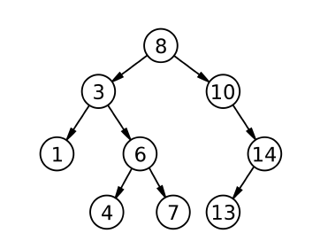

# 이진 검색 트리

# 이진 검색 트리란?

---

이진 검색 트리는 자료를 저장하는 컨테이너 입니다. 일반 배열, 리스트, 큐와는 다르게 자료를 일정한 순서에 따라 '정렬'된 상태로 저장합니다.

이 점을 이용해서 원소의 추가와 삭제 뿐만 아니라 특정 원소의 존재 여부 확인 등의 다양한 연산을 빠르게 제공합니다.

이 챕터에서 소개할 애들은 이진 검색 트리(binary search tree)와 그 별종 들 입니다.

## 이진 검색 트리의 정의와 순회

---

이진 검색 트리는 다음과 같은 성질을 만족하는 트리입니다.

1. 각 노드가 자식 노드를 최대 두 개 까지만 가질 수 있습니다.
2. 이진 탐색(binary search)의 성질을 이용합니다.

정형적인 이진 검색트리를 살펴봅시다.



왼쪽 자식노드는 부모노드보다 작은 값을, 오른쪽 자식노드는 부모노드보다 큰 값을 가집니다.

따라서 이진탐색과 동일하게 특정 값을 찾는데에 있어서 매번 후보의 수를 절반씩 줄어나갈 수 있으므로, O(lgN)시간에 그 값을 찾을 수 있습니다.

따라서 이진 검색 트리는 매번 후보의 수를 절반씩 줄어 나갈 수 있으므로, O(lgN)시간에 그 값을 찾을 수 있습니다.

예시로 다음 그림에서 14가 존재하는지 확인한다고 했을 때, 매 노드에서 저희는 어느쪽에서 14을 살펴보아야 하는지 알 수 있습니다.

## 이진 트리의 추가와 삭제

---

이진트리의 진가는 원소를 삽입할 때 드러납니다.

정렬된 배열과 비교를 해봅시다. 정렬된 배열은 원소를 삽입을 할려면 삽입할 위치를 우선 찾고 그 뒤 원소들을 한칸씩 뒤로 밀어야 합니다.

하지만 이진검색트리는 그냥 추가해야할 위치에 추가하면 됩니다. (균형 이진트리가 아닙니다!)

이진트리의 삭제는 조금 더 까다롭습니다. '합치기' 연산을 하게 됩니다.


20을 삭제한다고 해봅시다.

20의 왼쪽 서브트리를 A라고 하고, 오른쪽 서브트리를 B라고 해봅시다.

두 트리 A와 B에 대해 A의 최대 원소가 B의 최소 원소보다 작은 성질은 자연스럽게 만족합니다.

이 그림에서는 19(왼쪽 서브트리의 최대 자식)을 루트로 합치게 되었습니다. 합치기 연산은 재귀로 실행이 됩니다.


이 케이스는 그냥 25을 삭제하면 됩니다. 굳이 더 설명하지 않겠습니다.

책에서는 왼쪽 서브트리의 루트를 루트로 합치는 방법을 소개합니다.

### 시간 복잡도 분석

---

이진 검색 트리에 대한 모든 연산은 모두 루트에서 한 단계씩 트리를 내려가며 재쉬 호출을 통해 수행되므로, 최대 재귀 호출의 횟수는 트리의 높이 h와 같습니다.

따라서 이진 검색 트리의 모든 연산의 시간 복잡도는 O(h)입니다.

그렇다면 h는 어떻게 결정이 될까요?

높이는 어떤 순서로 추가되고, 삭제되느냐에 따라 크게 달라집니다.

1부터 N까지 순서대로 숫자가 추가되었다고 해봅시다.


위의 그림처럼 편향트리가 되어 버립니다. 이 경우 노드 개수는 5개이지만 높이도 5가 되어버립니다. 사실상 일방향 연결리스트와 동일한 구조입니다.

우리가 원하는 이상적인 케이스는 가급적 가로로 넓게 퍼지고 평평한 트리입니다. 트리의 높이가 1 높아질 때마다 트리에 들어갈 수 있는 원소의 수가 대략 두 배 늘어난다는 점을 고려하면 트리의 최소 높이는 O(lgN)이 됩니다.

이를 위해 이진 트리 검색의 변종들이 여러개가 있는데 이들을 balanced binary search tree( 균형 잡힌 이진 트리)라고 부릅니다.

# 너드인가, 너드가 아닌가?

---

알고리즘 대회를 참가하는데, 채점관을 할 자원 봉사자를 뽑습니다.

채점관의 수는 5명이지만, 10만명이 넘는 사람들이 지원을 할 것으로 예상이 됩니다.

따라서 너드들만 받아주기로 했습니다.

어떤 사람의 너드 지수는 다음 두가지 값에 따라 결정됩니다.

알고스팟 알고리즘 채점 시스템에서 푼 문제의 수: p

밤 새면서 지금까지 끓여먹은 라면 그릇 수: q

우리가 이 수치를 통해 알 수 있는 것은 너드일 가능성입니다.
즉 이것을 통해 너드가 아닌 사람을 걸러낼 수 있습니다.

어떤 참가자 a의 문제수 p<sub>a</sub>와 그릇수 q<sub>a</sub>와

참가자 b의 문제수 p<sub>b</sub>와 그릇수 q<sub>b</sub>가 주어질 때,

p<sub>a</sub> < p<sub>b</sub> 이고 q<sub>a</sub> < q<sub>b</sub> 이면 참가자 a는 너드일 가능성이 없습니다.

예를 들어 다음 4명이 순서대로 참가한다고 해봅시다.

1. 72, 50
2. 57, 67
3. 74, 55
4. 64, 60

이들이 참가 신청을 할때마다 참가 가능자의 수는 1, 2, 2, 3으로 변합니다.


위의 그림을 보면 됩니다. 점이 내부에 있으면 너드일 가능성이 없습니다.

## 풀이

---

이 문제에서 우리가 해야할 일은 단순합니다. 평면에 새 점이 하나 찍힐 때마다 기존 점들 중에 이 점의 너드 가능성을 박탈 시킬 수 있는 점이 있는지 찾아봅니다.

있다면 새 점은 무시하고, 없다면 새 점을 너드 후보자로 인정하고 기존 점들의 너드 가능성을 박탈 시킬수 있는지 찾아봅니다. 있다면 기존 점들을 지워버리면 됩니다.

이 너드 후보자들을 배열에 저장한다고 해보면, N개의 지원자에 대해 매번 O(N)탐색을 해야 하므로, O(N^2)가 시간 복잡도로 나옵니다.

N의 최대치는 5만이여서 시간초과가 납니다.

이때 그림을 보면 왼쪽 위에서 오른쪽 아래로 내려가는 계단형태를 띈걸 볼 수 있습니다. x는 증가하고 y는 감소하는 꼴이죠.

따라서 x좌표를 기준으로 정렬을 했을 때, 어떤 점이 이 점들에게 자격을 박탈당하는지 알려면, 바로 오른쪽에 있는 점만 확인하면 됩니다. 나보다 크면 박탈당하는 거고 내가 크면 살아남는 것입니다. 반대로 내 왼쪽에 있는 점들이 나보다 작으면 그 점들은 박탈당하는 것입니다.

1.  내가 박탈당하는지 안당하는지를 판단하는 함수
2.  나로 인해 박탈당하는 애들을 트리에서 제거하는 함수.

두가지가 필요합니다.

```C++
map<int, int> coords;// 너드 후보자들의 목록을 저장. key는 x좌표, value는 y좌표

// 새로운 점 (x, y)가 기존의 다른 점들에 지배당하는지 확인
bool isDominated(int x, int y)
{
	// x보다 오른쪽에 있는 점 중 가장 왼쪽의 있는 점을 찾는다. x 이상의 키중 가장 작은 값을 줌.
	map<int, int>::iterator it = coords.lower_bound(x);
	// 없다면 박탈 당하지 않는 점.
	if (it == coords.end()) return false;

	// x보다 오른쪽에 있는 점 중 가장 위에 있는 점이다. 박탈당한다면 true를 반환
	return y < it->second;
}
```

```C++
// 새로운 점 (x, y)에 박탈당하는 점들을 트리에서 제거
void removeDominated(int x, int y)
{
	map<int, int>::iterator it = coords.lower_bound(x);
	// (x, y) 보다 왼쪽에 있는 점이 없는 경우
	if (it == coords.begin()) return;

	--it;//왼쪽으로 이동
	while (true)
	{
		// (x, y) 바로 왼쪽에 오는 점을 찾는다.
		// it 포인트가 (x, y) 점에 박탈되지 않는다면 종료
		if (it->second > y) break;
		// 이전 점이 더 없으므로 it만 지우고 종료
		if (it == coords.begin())
		{
			coords.erase(it);
			break;
		}

		// 이전 점으로 iterator를 옮기고 it를 지운다.
		else
		{
			map<int, int>::iterator jt = it;
			--jt;
			coords.erase(it);
			it = jt;
		}
	}
}
```

### 트립

---

입력이 특정 순서로 주어 질때 그 성능이 떨어진다는 이진 검색 트리의 단점을 해결 하기 위해 나왔습니다.

트리의 형태가 원소들의 추가 순서에 따라 결정되지 않고 난수에 의해 임의대로 결정됩니다. 때문에 원소들이 어느 순서대로 추가되고 삭제되더래도 트리의 높이의 기대치는 항상 일정합니다.

이와 같은 속성을 유지하기 위해 트립은 노드들에게 우선순위를 부여하는데, 원소의 대소관계나 입력 순서와는 상관없습니다.

다음 2가지의 조건을 갖습니다.

1. 모든 노드에 대해 왼쪽 서브트리에 있는 노드들의 원소는 해당 노드의 원소보다 작고, 오른쪽 서브트리에 있는 노드들의 원소는 해당 노드의 원소보다 큽니다.
2. 모든 노드의 우선순위는 자식보다 크거나 같습니다.

예시를 봅시다.

1부터 7까지 순서대로 입력한다고 해봅시다. 원래였으면 편향 트리가 생겼을 것입니다.

하지만 트립을 이용하고, 우선순위가 난수에 의해 {37, 49, 13, 31, 65, 14, 25}가 나왔다면,


그림처럼 꽤 가로로 펄쳐지게 됩니다.

# 문제 풀이

유태정: https://www.acmicpc.net/problem/7662

김하진:

박진영: https://leetcode.com/problems/trim-a-binary-search-tree/

서민혁:

이재혁:

이성구: https://leetcode.com/problems/recover-binary-search-tree/submissions/952722304/

김재헌:

한태혁: https://leetcode.com/problems/serialize-and-deserialize-bst/

박상준: https://www.codewars.com/kata/571a551a196bb0567f000603

조민준:

정준우:
