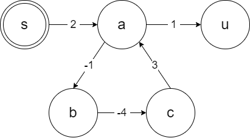
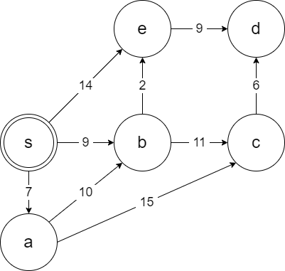
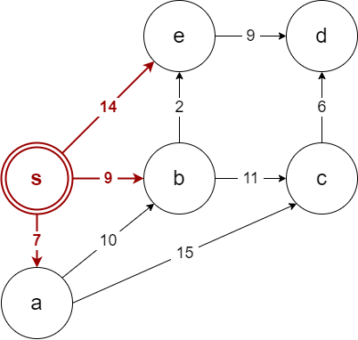
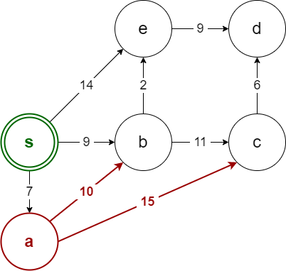
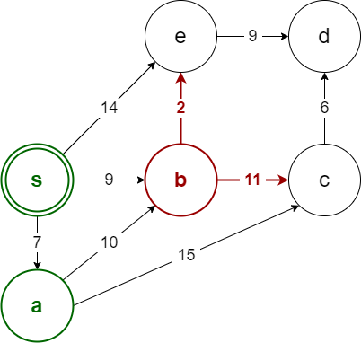
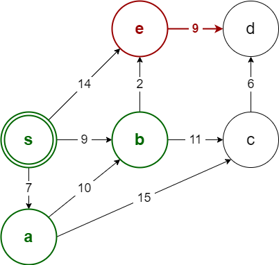
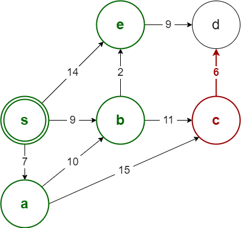
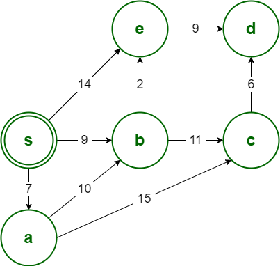
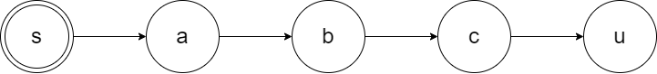
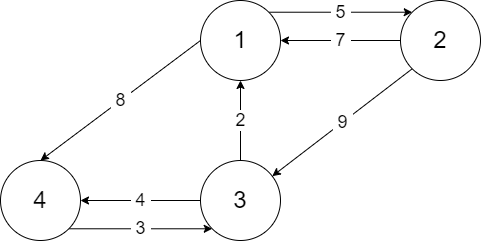

# 최단 경로 알고리즘

**최단 경로 알고리즘**은 주어진 그래프에서 주어진 두 정점을 연결하는 가장 짧은 경로의 길이를 찾는 알고리즘입니다.

이전에 살펴봤다시피 가중치가 없는 그래프에서는 너비 우선 탐색으로 구할 수 있었습니다.

여기서는 가중치가 있는 그래프만을 다루며, 음수 가중치를 갖는 간선이 있을 수 있습니다.

**다만, 음수 사이클이 존재하는 경우 최단 거리를 구할 수 없습니다.**



<br>

최단 경로 알고리즘은 **단일 시작점 알고리즘**과 **모든 쌍 알고리즘**으로 나뉩니다.

<br>

**단일 시작점 알고리즘**은 너비 우선 탐색을 기반으로 설계돼 있습니다.

하나의 시작점과 그 시작점으로부터 나머지 각 정점들까지의 최단 거리를 모두 구합니다.

계산 결과는 $V$ 크기의 1차원 배열이 됩니다.

<br>

**모든 쌍 알고리즘**은 모든 정점의 쌍에 대해 최단 거리를 계산합니다.

모든 정점들 간의 최단 거리를 모두 계산합니다.

계산 결과는 $V \times V$ 크기의 2차원 배열이 됩니다.

<br>

또한, 우리가 다룰 알고리즘들은 모두 방향 그래프를 기준으로 동작합니다.

무방향 그래프의 최단 거리를 구하려면 양방향 간선을 두 개의 단방향으로 쪼개면 됩니다.

이 때, 무방향 음수 간선이 있으면 음수 사이클이 발생하므로 최단 경로를 구할 수 없습니다.

<br>

## 다익스트라

**다익스트라 알고리즘**은 단일 시작점 최단 경로 알고리즘입니다.

음수 간선이 없는 경우에만 사용할 수 있습니다.

기본적인 아이디어는 너비 우선 탐색과 동일하며, 너비 우선 탐색과 달리 *우선순위 큐*를 사용합니다.

<br>

### 작동방식

우선순위 큐에는 정점과, 시작점으로부터 그 정점까지의 최단거리 값이 한 쌍으로 들어갑니다.

그리고 최단거리 값의 오름차순으로 정렬이 됩니다.

맨 처음에는 시작점과 0의 값이 한 쌍으로 들어갑니다.

그리고 인접한 정점들을 모두 검사하며 최단거리를 갱신하고, 우선순위 큐에 넣어줍니다.

구체적으로는 아래의 과정을 거칩니다.



| s     | a   | b   | c   | d   | e   |
| ----- | --- | --- | --- | --- | --- |
| **0** | INF | INF | INF | INF | INF |

| PQ         |     |     |     |     |
| ---------- | --- | --- | --- | --- |
| **(0, s)** |     |     |     |     |



| s   | a     | b     | c   | d   | e      |
| --- | ----- | ----- | --- | --- | ------ |
| 0   | **7** | **9** | INF | INF | **14** |

| PQ         |            |             |     |     |
| ---------- | ---------- | ----------- | --- | --- |
| **(7, a)** | **(9, b)** | **(14, e)** |     |     |



| s   | a   | b   | c      | d   | e   |
| --- | --- | --- | ------ | --- | --- |
| 0   | 7   | 9   | **22** | INF | 14  |

| PQ     |         |             |     |     |
| ------ | ------- | ----------- | --- | --- |
| (9, b) | (14, e) | **(22, c)** |     |     |



| s   | a   | b   | c      | d   | e      |
| --- | --- | --- | ------ | --- | ------ |
| 0   | 7   | 9   | **20** | INF | **11** |

| PQ          |         |             |         |     |
| ----------- | ------- | ----------- | ------- | --- |
| **(11, e)** | (14, e) | **(20, c)** | (22, c) |     |



| s   | a   | b   | c   | d      | e   |
| --- | --- | --- | --- | ------ | --- |
| 0   | 7   | 9   | 20  | **20** | 11  |

| PQ      |         |             |         |     |
| ------- | ------- | ----------- | ------- | --- |
| (14, e) | (20, c) | **(20, d)** | (22, c) |     |



| s   | a   | b   | c   | d   | e   |
| --- | --- | --- | --- | --- | --- |
| 0   | 7   | 9   | 20  | 20  | 11  |

| PQ      |         |     |     |     |
| ------- | ------- | --- | --- | --- |
| (20, d) | (22, c) |     |     |     |



| s   | a   | b   | c   | d   | e   |
| --- | --- | --- | --- | --- | --- |
| 0   | 7   | 9   | 20  | 20  | 11  |

| PQ  |     |     |     |     |
| --- | --- | --- | --- | --- |
|     |     |     |     |     |

이러한 과정을 코드로 작성하면 아래와 같습니다.

```cpp
#define MAX_V 100
#define INF 987654321

#include <vector>
#include <queue>

using namespace std;

int V;
vector<pair<int, int> > adj[MAX_V]; // 인접 리스트

vector<int> dijkstra(int src) {
    // src 부터 나머지 정점들로의 거리를 저장하는 배열
    vector<int> dist(V, INF);
    dist[src] = 0;

    priority_queue<pair<int, int>, vector<pair<int, int> >, greater<pair<int,int> > > pq;
    pq.push(make_pair(0, src));

    while (!pq.empty()) {
        int cost = pq.top().first;
        int here = pq.top().second;
        pq.pop();

        // 이미 계산된 거리가 더 최적이면 스킵
        if (dist[here] < cost) continue;

        // 현재 정점에서 연결된 다른 정점들을 검사
        for (const auto& [there, length] : adj[here]) {
            int nextDist = cost + length;

            // 현재 계산된 새로운 거리가 더 가까우면 거리를 갱신하고 큐에 추가
            if (nextDist < dist[there]) {
                dist[there] = nextDist;
                pq.push(make_pair(nextDist, there));
            }
        }
    }
    return dist;
}
```

### 실제 경로 구하기

너비 우선 탐색에서 살펴봤던대로 스패닝 트리를 계산하여 구할 수 있습니다.

```diff cpp
#define MAX_V 100
#define INF 987654321

#include <vector>
#include <queue>

using namespace std;

int V;
vector<pair<int, int> > adj[MAX_V];

vector<int> dijkstra(int src) {
    vector<int> dist(V, INF);
+   // 너비 우선 탐색 스패닝 트리에서 i의 부모의 번호. 루트인 경우 자신의 번호
+   vector<int> parent(V, -1);
    dist[src] = 0;
    parent[src] = src;

    priority_queue<pair<int, int>, vector<pair<int, int> >, greater<pair<int,int> > > pq;
    pq.push(make_pair(0, src));

    while (!pq.empty()) {
        int cost = pq.top().first;
        int here = pq.top().second;
        pq.pop();

        if (dist[here] < cost) continue;

        for (const auto& [there, length] : adj[here]) {
            int nextDist = cost + length;

            if (nextDist < dist[there]) {
                dist[there] = nextDist;
                pq.push(make_pair(nextDist, there));
+               parent[there] = here; // 스패닝 트리 부모 갱신
            }
        }
    }
    return dist;
}
```

### 시간복잡도

정점의 개수가 $V$, 간선의 개수가 $E$일 때, 다익스트라 알고리즘의 시간복잡도는 $O(ElgV)$입니다.

모든 간선을 한 번씩만 검사하며, 모든 정점이 한 번 이상 우선순위 큐에 들어가기 때문입니다.

<br>

## 벨만-포드

**벨만 포드 알고리즘**은 단일 시작점 최단 경로 알고리즘입니다.

그래프에 음수 간선이 있어도 사용할 수 있으며, 심지어 음수 사이클이 있어도 이를 알아낼 수 있습니다.

다익스트라 알고리즘에서는 모든 정점을 단 한 번씩만 방문하여 최단 경로를 확정했었습니다.

벨만 포드 알고리즘에서는 이와 달리 모든 간선을 최대 $V$번 순회하여 최단 경로를 갱신해 나갑니다.

<br>

시작 정점에서 가장 먼 정점이더라도 그 둘을 잇는 간선의 개수는 최대 $V-1$개입니다.

만약 그래프가 연결 리스트처럼 일자로 늘여져 있는 경우를 고려해봅시다.

그리고 간선들의 순회 순서가 $(c, u)$, $(b, c)$, $(a, b)$, $(s, a)$라고 해봅시다.

실제로 시작 정점이 0번째라는 보장은 없기에 이런 경우가 있을 수 있습니다.



위의 경우 각 순회마다 하나의 정점씩만 최단 경로로 확정되어 갱신될 것입니다.

그렇더라도 마지막 $u$ 정점이 확정되기 까지는 $V-1$번의 순회만 거치면 됩니다.

$V$ 번째 순회에서는 어떤 갱신도 일어나지 않습니다.

따라서 벨만 포드 알고리즘에서는 최대 $V-1$번으로 최단 경로를 구할 수 있습니다.

<br>

그런데 만약, 아래처럼 음수 사이클이 있는 경우라면 이야기가 달라집니다.


$(a, b) \rightarrow (b, c) \rightarrow (c, a)$ 의 사이클을 돌 때마다 최단 경로가 게속 갱신됩니다.

이 경우 $V-1$ 번의 순회를 마친 후 $V$ 번째 순회에도 최단 경로가 갱신됩니다.

즉, $V$ 번째 순회에서 갱신이 일어나는지 여부로 음수 사이클의 여부를 알 수 있습니다.

결론적으로, 벨만 포드 알고리즘의 시간 복잡도는 $O(VE)$입니다.

코드는 아래와 같이 작성됩니다.

<br>

```cpp
#define MAX_V 100
#define INF 987654321

#include <utility>
#include <vector>

using namespace std;

int V;
vector<pair<int, int> > adj[MAX_V]; // 인접 리스트

vector<int> bellmanFord(int src) {
    // src 정점부터 나머지 정점으로의 최단거리를 저장하는 배열
    vector<int> upper(V, INF);
    upper[src] = 0;

    // 최단거리 갱신이 발생했는지 여부
    bool updated;
    for (int iter = 0; iter < V; ++iter) {
        updated = false;

        // 모든 간선에 대하여 반복합니다.
        for (int here = 0; here < V; ++here) {
            for (const auto& [there, cost] : adj[here]) {

                // 현재 정점의 거리가 유효하면 이웃 정점의 거리를 갱신합니다.
                if (upper[here] != INF && upper[there] > upper[here] + cost) {
                    upper[there] = upper[here] + cost;
                    updated = true;
                }
            }
        }

        // 더 이상 갱신이 일어나지 않으면 최단 거리를 모두 계산한 것입니다.
        if (!updated) break;
    }

    // 마지막(V번째) 순회에서도 갱신이 일어났다면 음수 사이클이 있는 것입니다.
    if (updated) upper.clear();

    return upper;
}
```

<br>

## 플로이드 워셜

**플로이드 워셜 알고리즘**은 모든 쌍 최단 거리 알고리즘입니다.

이 알고리즘은 두 정점 $u, v$를 잇는 경로에 다른 정점을 경유하여 경로를 갱신하는 방식으로 작동합니다.

모든 정점 쌍($V \times V$)에 대해 그 둘을 잇는 경로에 다른 정점($V$)을 경유시킴으로써 경로를 갱신합니다.

따라서 이 알고리즘의 시간 복잡도는 $O(V^3)$이 됩니다.

<br>



> 초기상태

|     | 1   | 2   | 3   | 4   |
| --- | --- | --- | --- | --- |
| 1   | 0   | 5   | INF | 8   |
| 2   | 7   | 0   | 9   | INF |
| 3   | 2   | INF | 0   | 4   |
| 4   | INF | INF | 3   | 0   |

> 1번 정점을 거쳐가는 경우

|     | 1   | 2   | 3   | 4   |
| --- | --- | --- | --- | --- |
| 1   | 0   | 5   | INF | 8   |
| 2   | 7   | 0   | 9   | INF |
| 3   | 2   | INF | 0   | 4   |
| 4   | INF | INF | 3   | 0   |

2 → 4의 비용이 지금은 INF인데, 2 → 1 → 4의 비용은 7 + 8 = 15입니다.

그러면, 기존보다 더 짧은 경로를 찾은 것이므로 갱신됩니다.

|     | 1   | 2   | 3   | 4      |
| --- | --- | --- | --- | ------ |
| 1   | 0   | 5   | INF | 8      |
| 2   | 7   | 0   | 9   | **15** |
| 3   | 2   | INF | 0   | 4      |
| 4   | INF | INF | 3   | 0      |

... 이를 반복하면 아래처럼 최단 경로 테이블이 완성됩니다.

<br>

코드는 아래와 같이 작성됩니다.

```cpp
#define MAX_V 100
#define INF 987654321

#include <vector>

using namespace std;

int V;
int adj[MAX_V][MAX_V]; // 인접 행렬

void floyd() {
    // 자기 자신으로 가는 경로는 모두 0으로 초기화합니다.
    for (int i = 0; i < V; ++i) adj[i][i] = 0;

    for (int k = 0; k < V; ++k)
        for (int i = 0; i < V; ++i)
            for (int j = 0; j < V; ++j)
                adj[i][j] = min(adj[i][j], adj[i][k] + adj[k][j]);
}
```

<br>

### 최적화

1. `i`에서 `k`로 가는 경로가 있는지 검사

   이러면 시간복잡도는 변하지 않지만 10%에서 20%까지 수행 시간이 단축된다고 합니다.

```diff cpp
#define MAX_V 100
#define INF 987654321

#include <vector>

using namespace std;

int V;
int adj[MAX_V][MAX_V]; // 인접 행렬

void floyd() {
    for (int i = 0; i < V; ++i) adj[i][i] = 0;

    for (int k = 0; k < V; ++k)
        for (int i = 0; i < V; ++i)
+            if (adj[i][k] < INF) // 경로가 있는지 검사
                for (int j = 0; j < V; ++j)
                    adj[i][j] = min(adj[i][j], adj[i][k] + adj[k][j]);
}
```

### 실제 경로 구하기

실제 경로를 구하는 방법은 단일 시작점 알고리즘들과 조금 다릅니다.

```diff cpp
#define MAX_V 100
#define INF 987654321

#include <vector>

using namespace std;

int V;
int adj[MAX_V][MAX_V];
+int via[MAX_V][MAX_V];

void floyd() {
    for (int i = 0; i < V; ++i) adj[i][i] = 0;
+   memset(via, -1, sizeof(via));

    for (int k = 0; k < V; ++k)
        for (int i = 0; i < V; ++i)
            for (int j = 0; j < V; ++j)
-               adj[i][j] = min(adj[i][j], adj[i][k] + adj[k][j]);
+               if (adj[i][j] > adj[i][k] + adj[k][j]) {
+                   via[i][j] = k;
+                   adj[i][j] = adj[i][k] + adj[k][j];
+               }
}

+void reconstruct(int u, int v, vector<int>& path) {
+    if (via[u][v] == -1) {
+        path.push_back(u);
+        if (u != v) path.push_back(v);
+    }
+    else {
+        int w = via[u][v];
+        reconstruct(u, w, path);
+        path.pop_back() // w가 중복으로 들어가므로 지운다.
+        reconstruct(w, v, path);
+    }
+}
```

## 정리

- 양방향 간선은 각 방향의 단일 방향 간선으로 바꿔서 적용
- 음수 사이클이 있으면 최단거리 구하기 불가능

1. 다익스트라 알고리즘
   - 단일 시작점
   - 모든 간선이 양의 가중치
   - 시간복잡도 $O(ElgV)$
1. 벨만 포드 알고리즘
   - 단일 시작점
   - 음의 가중치 간선도 가능
   - 시간복잡도 $O(VE)$
1. 플루이드 워셜 알고리즘
   - 모든 쌍
   - 음의 가중치 간선도 가능
   - 시간복잡도 $O(V^3)$

<br>

## 예시 인용 및 참고 자료 목록

[다익스트라 알고리즘(Dijkstra's Algorithm) - kks227](https://blog.naver.com/kks227/220796029558)

[벨만 포드 알고리즘(Bellman-Ford Algorithm) - kks227](https://blog.naver.com/kks227/220796963742)

[플로이드 와샬 알고리즘(Floyd-Warshall Algorithm) - kks227](https://blog.naver.com/kks227/220797649276)

[24. 플로이드 와샬(Floyd Warshall) 알고리즘 - ndb796](https://blog.naver.com/ndb796/221234427842)

## 문제 풀이

> ### 관련 문제 목록 바로가기
>
> [solved.ac](<https://solved.ac/search?query=(%23dijkstra%20%7C%20%23floyd_warshall%20%7C%20%23bellman_ford)>)
> |
> [LeetCode](https://leetcode.com/problemset/all/?topicSlugs=shortest-path)

김하진:

김재헌: https://www.acmicpc.net/problem/2176

박상준:

박진영: https://leetcode.com/problems/cheapest-flights-within-k-stops/

서민혁:

유태정:

이재혁:

이성구:

조민준:

정준우:

한태혁:
