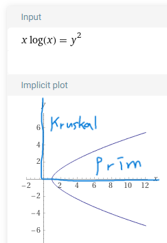

# 최소 스패닝 트리(Minimum Spanning Tree)

## Spanning Tree?

- 그래프에서 일부 간선을 선택해서 만든 트리

- 그래프 내의 모든 정점을 포함하는 트리

- 간선의 수가 가장 적은 그래프

## Spanning Tree의 특징

- 여러 Spanning Tree가 존재 가능

- DFS, BFS로 찾을 수 있고

- 사이클이 없다

- 간선의 수 n-1

통신 네트워크 구축 같은 곳에 쓰인다고 한다

## MST?

- 간선의 가중치 합이 최소

- 마찬가지로, n-1의 간선 / 사이클이 없음

## MST 구현 방법

### Kruskal 알고리즘

간선으로 iterate / Greedy method

먼저 간선을 가중치 오름차순으로 정렬

1. 간선을 선택
   1. 가중치가 가장 낮은 간선 선택
   2. 간선이 사이클을 형성하면 제거
2. 해당 간선을 MST 집합에 추가

### Kruskal 알고리즘 시간 복잡도

간선을 가중치로 정렬 -> e log e

사이클 생성 여부 -> union-find 알고리즘 이용

### Prim 알고리즘

정점으로 iterate

1. 시작 정점을 MST 집합에 추가
2. 이전에 만들어진 MST 집합에 인접한 정점 중 최소 간선으로 연결된 정점 추가
3. 정점을 모두 포함할 때까지 반복

### Prim 알고리즘 시간 복잡도

V-1번 인접한 정점까지의 가중치를 비교 => V^2

? 최소 힙으로 트리에 포함될 간선을 찾으면 E log V (다익스트라랑 비슷)

## 어떤거 쓰지?

e log e vs V^2

그래프 내에 적은 숫자의 간선만을 가지는 ‘희소 그래프(Sparse Graph)’의 경우 Kruskal 알고리즘이 적합

그래프에 간선이 많이 존재하는 ‘밀집 그래프(Dense Graph)’ 의 경우는 Prim 알고리즘이 적합

### ElogE - V^2 그래프

